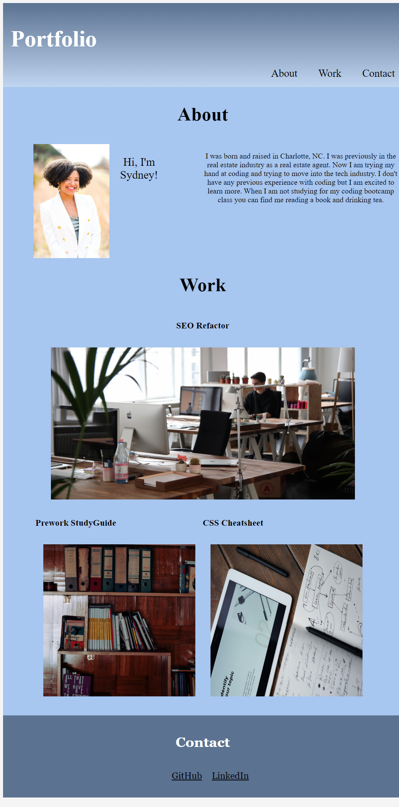

# Professional-Portfolio

[Link to my project](https://www.google.com)

## Table of Contents
- [Description](#description)
- [Visuals](#visuals)

## Description
This project consisted of creating a portfolio website to showcase our skills and deployed web applications we have made. We were not given any starter code for this project the web application was built from scratch. The objectives for this project were to implement the new skills we learned like flexbox, media queries, and CSS variables. During this project I had fun with trying out and testing different variables as I went along like linear-gradients and hover elements. The hardest thing to implement on this project at first was the formatting of each image and their relation to eachother. 

## Visuals

This image depicts the website deployed. The portfolio
shows my name with a recent photo and links to sections the About, Work, Contact. The images under the section section work when clicked on will go to that deployed application. 